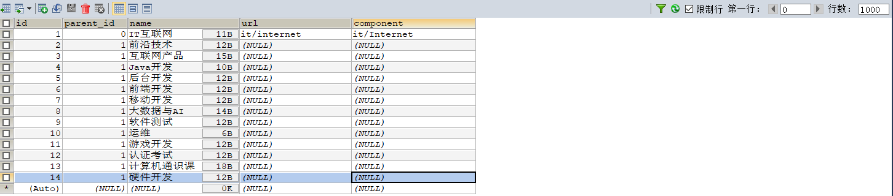

# ke
Monitor System for ke of qq.

# 1 创建数据表

## 1.1 menu表

采用树形结构建立多级菜单表。

```sql
CREATE TABLE `menu` (
  `id` int(11) NOT NULL AUTO_INCREMENT COMMENT '主键，菜单id',
  `parent_id` int(11) NOT NULL COMMENT '父级菜单id',
  `name` tinytext COLLATE utf8_unicode_ci NOT NULL COMMENT '菜单名称',
  `url` varchar(200) COLLATE utf8_unicode_ci DEFAULT NULL COMMENT '路由地址',
  `component` varchar(200) COLLATE utf8_unicode_ci DEFAULT NULL COMMENT '组件地址',
  PRIMARY KEY (`id`)
) ENGINE=InnoDB AUTO_INCREMENT=16 DEFAULT CHARSET=utf8 COLLATE=utf8_unicode_ci
```



## 1.2 info表

抽离课程的信息，满足建表的三大规范。

```sql
CREATE TABLE `info` (
  `id` int(11) NOT NULL AUTO_INCREMENT COMMENT '主键',
  `menu_id` int(11) NOT NULL COMMENT '菜单id',
  `course_name` varchar(50) COLLATE utf8_unicode_ci NOT NULL COMMENT '课程名称',
  `teacher_name` varchar(50) COLLATE utf8_unicode_ci NOT NULL COMMENT '授课老师姓名',
  `sale` int(11) NOT NULL COMMENT '售价',
  PRIMARY KEY (`id`)
) ENGINE=InnoDB AUTO_INCREMENT=40 DEFAULT CHARSET=utf8 COLLATE=utf8_unicode_ci
```


## 1.3 course表

创建课程购买相关信息表。

```sql
CREATE TABLE `course` (
  `id` int(11) NOT NULL AUTO_INCREMENT COMMENT '主键',
  `course_id` int(11) NOT NULL COMMENT '课程id',
  `page_view` int(11) NOT NULL DEFAULT '0' COMMENT '浏览数',
  `selling_quantity` int(11) NOT NULL DEFAULT '0' COMMENT '出售的数量',
  `log_date` date NOT NULL COMMENT '日期',
  PRIMARY KEY (`id`)
) ENGINE=InnoDB AUTO_INCREMENT=42706 DEFAULT CHARSET=utf8 COLLATE=utf8_unicode_ci
```

course表的相关数据采用**自定义函数+存储过程**随机生成。

### 1.3.1 sale_rand_num函数

```sql
DELIMITER $$
USE `ke`$$
DROP FUNCTION IF EXISTS `sale_rand_num`$$
CREATE DEFINER=`root`@`localhost` FUNCTION `sale_rand_num`(from_num INT, to_num INT) RETURNS INT(11)
BEGIN
	DECLARE i INT DEFAULT 0;
	SET i = FLOOR(from_num+RAND()*(to_num-from_num+1));
	RETURN i;
    END$$
DELIMITER ;
```

### 1.3.2 view_rand_num函数

```sql
DELIMITER $$
USE `ke`$$
DROP FUNCTION IF EXISTS `view_rand_num`$$
CREATE DEFINER=`root`@`localhost` FUNCTION `view_rand_num`(start_num INT,from_num INT, to_num INT) RETURNS INT(11)
BEGIN
	DECLARE i INT DEFAULT 0;
	SET i = start_num + FLOOR(from_num+RAND()*(to_num-from_num+1));
	RETURN i;
    END$$
DELIMITER ;
```

### 1.3.3 insert_course存储过程

```sql
DELIMITER $$
USE `ke`$$
DROP PROCEDURE IF EXISTS `insert_course`$$
CREATE DEFINER=`root`@`localhost` PROCEDURE `insert_course`(IN cid INT,IN max_num INT )
BEGIN
	DECLARE th INT DEFAULT 0;
	DECLARE i INT DEFAULT 0;
	DECLARE d DATE DEFAULT CURDATE();
	REPEAT
		SET th = th+1;
		SET i = 0;
		SET d = CURDATE();
		SET autocommit = 0;
		REPEAT
			SET i = i+1;
			SET d = DATE_SUB(d,INTERVAL 1 DAY);
			INSERT INTO `ke`.`course`(course_id,page_view,selling_quantity,log_date) VALUES (th,view_rand_num(1500,1,500),sale_rand_num(1,500),d);
		UNTIL i = max_num END REPEAT;
		COMMIT;
	  UNTIL th = cid END REPEAT;
    END$$
DELIMITER ;
```

采用存储过程生成课程近三年的随机信息：

```sql
CALL insert_course(39,365*3);
```

